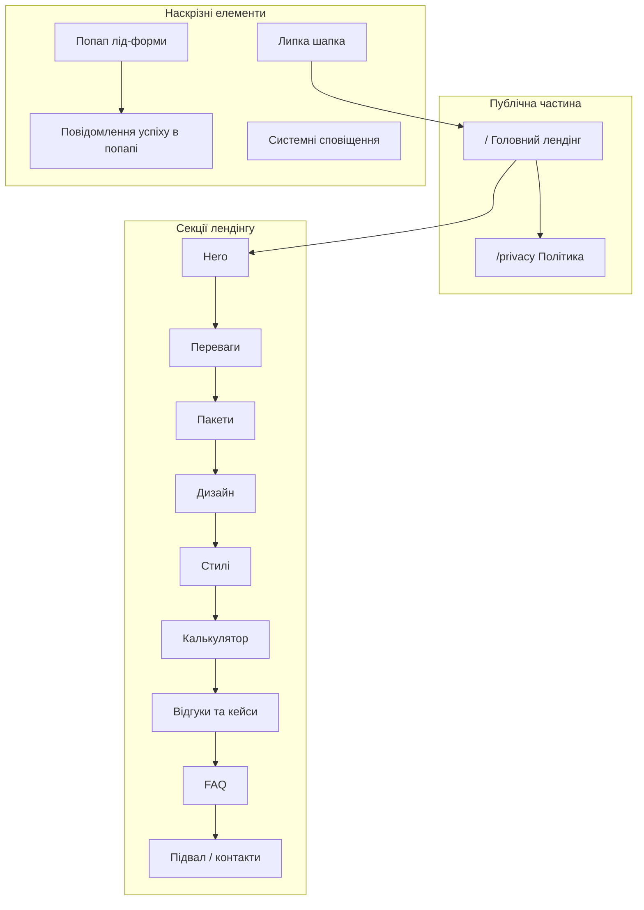

# 🗺️ Карта сайту та функціональна структура проєкту

**Проєкт:** Kontur+  
**Тип сайту:** односторінковий лендінг  
**Мова:** українська

---

## 1. Загальний огляд проєкту та архітектура

### 1.1. Короткий опис і мета

**Kontur+** — маркетинговий лендінг послуг ремонту квартир і будинків «під ключ» в Одесі.  

**Головна бізнес-мета сайту:** зібрати якісні заявки (ліди) від потенційних клієнтів через:

- дзвінок / кнопку «Замовити дзвінок»;
- вибір пакету послуг;
- попередній розрахунок вартості в калькуляторі;
- форми захоплення з ім’ям і телефоном.

### 1.2. Ієрархія сторінок (дерево сайту)

```text
Kontur+
├── /                     → Головний лендінг (усі ключові секції на одній сторінці)
│   ├── #hero             → Перший екран (УТП + CTA)
│   ├── #advantages       → Переваги
│   ├── #packages         → Послуги / Пакети
│   ├── #design           → Дизайн-проєкт
│   ├── #styles           → Стилі інтер’єру / підбір матеріалів
│   ├── #calculator       → Калькулятор вартості
│   ├── #proof            → Соціальний доказ (відгуки Google + кейси)
│   ├── #faq              → FAQ (акордеон)
│   └── #contacts         → Контакти / фінальний заклик (у підвалі або окремій секції)
│
└── /privacy              → Політика конфіденційності (окрема сторінка)
```

**Діаграма структури (Mermaid):**




### 1.3. Глобальні наскрізні елементи


| Елемент                      | Що містить                                                                                                         | Поведінка                                                                               |
| ---------------------------- | ------------------------------------------------------------------------------------------------------------------ | --------------------------------------------------------------------------------------- |
| **Header (Шапка)**           | Логотип Kontur+, телефон, кнопка «Замовити дзвінок», якірне меню секцій                                            | «Прилипає» до верху при скролі; плавний скрол до секцій з урахуванням висоти шапки      |
| **Footer (Підвал)**          | Контакти, юридичні дані, посилання на `/privacy`                                                                   | Дублює ключові контакти; посилання на політику веде на окрему сторінку                  |
| **Модальне вікно лід-форми** | Поля «Ім’я», «Телефон», прихований контекст (пакет / розрахунок калькулятора), кнопка відправки, згода з політикою | Єдина форма захоплення; відкривається з усіх CTA                                        |
| **Повідомлення успіху**      | Текст подяки + очікуваний час зворотного зв’язку                                                                   | Показується **в тому ж попапі** після успішної відправки (окремої Thank You Page немає) |
| **Системні сповіщення**      | Помилки валідації, помилка мережі/сервера                                                                          | Підказки біля полів і/або коротке повідомлення в попапі                                 |


---

## 2. Детальна карта сторінок та їх наповнення

### 2.1. Головна — Лендінг `/`


| Параметр          | Значення                                                                      |
| ----------------- | ----------------------------------------------------------------------------- |
| **Назва**         | Головна (лендінг Kontur+)                                                     |
| **URL**           | `/`                                                                           |
| **Призначення**   | Презентувати пропозицію, зняти сумніви, дати орієнтовну ціну і зібрати заявку |
| **Бізнес-задача** | Конверсія відвідувача → лід (телефон + ім’я + контекст інтересу)              |


#### Візуальний вигляд та ключові блоки (зверху вниз)

1. **Липка шапка**
  Логотип → якірне меню → телефон → CTA «Замовити дзвінок».
2. **Hero-блок (**`#hero`**)**
  - Головне УТП (оффер).  
  - Короткий підзаголовок.  
  - Фонове відео або графіка.  
  - Яскрава кнопка цільової дії (відкриває попап форми).  
  - Допоміжні маркери довіри (наприклад: фіксована ціна, гарантія, строк) — без перевантаження першого екрана.
3. **Блок «Переваги» (**`#advantages`**)**
  Короткі тези з іконками (сітка на десктопі, одна колонка на мобільному).
4. **Блок «Послуги / Пакети» (**`#packages`**)**
  Опис пакетів/тарифів із цінами та кнопками «Замовити».  
   Кожна кнопка передає в форму назву обраного пакету.  
   Пакети: **Базовий 460 $/м²**, **Оптимальний 580 $/м²** (рекомендований), **Максимальний 700 $/м²**.
5. **Блок «Дизайн-проєкт» (**`#design`**)**
  Короткий опис дизайн-послуги + CTA «Замовити проєкт».
6. **Блок «Стилі» (**`#styles`**)**
  Чотири стилі (лофт, мінімалізм, контемпорарі, скандинавський) + CTA на підбір матеріалів.
7. **Калькулятор (**`#calculator`**)**
  Інтерактивний попередній розрахунок вартості + CTA «Отримати точний розрахунок» / відправка заявки з параметрами розрахунку.
8. **Соціальний доказ (**`#proof`**)**
  - Рейтинг і відгуки з Google (автосинхронізація).  
  - Карусель відгуків (свайп на мобільному, стрілки на десктопі).  
  - Кейси: новобудова, вторинка, під оренду (Одеса).
9. **FAQ (**`#faq`**)**
  Акордеон: клік відкриває одну відповідь і закриває попередню.
10. **Підвал**
  Контакти (Одеса), юридичні реквізити, посилання на `/privacy`, повторний CTA за потреби.

#### Інтерактивний функціонал

- Якірна навігація з плавним скролом.  
- Відкриття єдиної лід-форми з різних CTA.  
- Передача контексту в форму: джерело кнопки, обраний пакет, параметри та результат калькулятора.  
- Валідація полів (ім’я, телефон у форматі України).  
- Калькулятор: зміна типу об’єкта, пакету, площі → миттєвий перерахунок.  
- Карусель відгуків / робіт.  
- Акордеон FAQ.  
- Клік по телефону (`tel:`) для мобільних.

#### Стани сторінки / модулів


| Стан                           | Де проявляється                    | Поведінка для користувача                                                 |
| ------------------------------ | ---------------------------------- | ------------------------------------------------------------------------- |
| **Завантаження**               | Відгуки Google, відправка форми    | Скелетон/спінер; кнопка форми тимчасово неактивна                         |
| **Успіх**                      | Попап після відправки              | Форма замінюється повідомленням подяки в попапі                           |
| **Помилка валідації**          | Поля форми / калькулятор           | Підказки під полями, фокус на першому помилковому полі                    |
| **Помилка сервера / мережі**   | Форма                              | Зрозуміле повідомлення «Спробуйте ще раз» без втрати введених даних       |
| **Порожній стан відгуків**     | Блок соціального доказу            | Запасний контент з адмінки або нейтральне повідомлення + рейтинг (якщо є) |
| **Недоступний авторозрахунок** | Калькулятор для «Будинок / Котедж» | Показ пояснення «індивідуальний кошторис» + CTA на заявку без автосуми    |


---

### 2.2. Політика конфіденційності `/privacy`


| Параметр          | Значення                                                                     |
| ----------------- | ---------------------------------------------------------------------------- |
| **Назва**         | Політика конфіденційності                                                    |
| **URL**           | `/privacy`                                                                   |
| **Призначення**   | Юридично коректно пояснити збір і обробку персональних даних (ім’я, телефон) |
| **Бізнес-задача** | Відповідність вимогам до лід-форм і довіра користувача                       |


#### Візуальний вигляд та ключові блоки

- Спрощена шапка (логотип + повернення на головну / телефон).  
- Заголовок сторінки.  
- Текстовий контент (розділи про оператора даних, які дані збираються, мета обробки, зберігання, права користувача, контакти).  
- Підвал з контактами та посиланням назад на `/`.

#### Інтерактивний функціонал

- Навігація «На головну».  
- Якорі всередині довгого тексту (за потреби).  
- З форми на лендінгу — посилання на цю сторінку (відкриття в новій вкладці або перехід).

#### Стани

- Стандартний контентний стан.  
- Якщо текст ще не наданий Замовником — тимчасовий плейсхолдер (згідно з ТЗ про тестовий контент), з можливістю заміни в адмінці.

---

## 3. Функціональні модулі та логіка

### 3.1. Ролі користувачів і доступ


| Роль                         | Що бачить / може робити                                                                |
| ---------------------------- | -------------------------------------------------------------------------------------- |
| **Гість (відвідувач сайту)** | Переглядає лендінг і `/privacy`, користується калькулятором, залишає заявку, телефонує |
| **Адміністратор / менеджер** | Вхід у спрощену CMS: редагування текстів/цін/відгуків, перегляд лід-бази зі статусами  |


### 3.2. Користувацькі сценарії (User Flow)

#### Сценарій A — Швидкий дзвінок / «Замовити дзвінок»

```text
Головна → клік «Замовити дзвінок» (шапка / hero)
       → відкривається попап форми
       → користувач вводить Ім’я + Телефон
       → успішна відправка
       → у попапі з’являється повідомлення подяки
       → заявка потрапляє в адмінку (лід-база)
       → спрацьовує подія конверсії (GTM / Meta Pixel)
```

#### Сценарій B — Вибір пакету

```text
Секція «Пакети» → «Замовити» на картці пакету
                → попап форми з уже підставленим пакетом
                → відправка → успіх у попапі → лід з назвою пакету
```

#### Сценарій C — Розрахунок у калькуляторі + заявка

```text
Секція «Калькулятор»
  → вибір типу об’єкта
  → (для квартири) вибір пакету + площі
  → перегляд орієнтовної суми та графіка оплат
  → CTA «Отримати точний розрахунок»
  → попап форми з параметрами розрахунку
  → відправка → успіх у попапі
  → у лід-базу йдуть: контакти + тип + пакет + площа + сума + надбавки
```

#### Сценарій D — Читання відгуків / робіт → заявка

```text
Блок соціального доказу → перегляд каруселі / кейсів
                       → CTA «Замовити» / «Отримати консультацію»
                       → форма → успіх у попапі
```

#### Сценарій E — Ознайомлення з політикою

```text
Форма або підвал → клік «Політика конфіденційності»
                 → сторінка /privacy
                 → повернення на головну
```

### 3.3. Єдина лід-форма (модуль лідогенерації)

**Поля (видимі):**

- Ім’я (обов’язкове)
- Телефон (обов’язкове, маска/валідація UA)

**Поля (приховані / службові):**

- Джерело CTA (hero / header / package / calculator / footer)
- Обраний пакет (якщо є)
- Параметри калькулятора (тип об’єкта, площа, ставка, надбавка, підсумок)
- Час відправки, UTM (якщо передаються маркетингом)

**Після успіху:** повідомлення в попапі (без окремої `/thank-you`).  
**Після помилки:** дані форми зберігаються, користувач може повторити відправку.

### 3.4. Логіка калькулятора вартості (запропонована бізнес-модель)

> У ТЗ формули має надати Замовник. Нижче — **робоча логіка для Kontur+**. Перед продакшеном суми/пакети підтверджуються Замовником і редагуються в адмінці.

#### 3.4.1. Вхідні параметри


| Параметр        | Варіанти                                        | Примітка                              |
| --------------- | ----------------------------------------------- | ------------------------------------- |
| **Тип об’єкта** | `Квартира у новобудові` / `Будинок / Котедж`    | Для будинку — без авторозрахунку суми |
| **Пакет**       | Базовий / Оптимальний / Максимальний            | Базова ставка за м²                   |
| **Площа**       | слайдер/поле, орієнтир **20–150 м²** (квартира) | Крок 1 м²                             |


#### 3.4.2. Базові ставки пакетів (стартові значення)


| Пакет        | Код       | Базова ставка |
| ------------ | --------- | ------------- |
| Базовий      | `basic`   | **460 $/м²**  |
| Оптимальний  | `optimal` | **580 $/м²**  |
| Максимальний | `maximum` | **700 $/м²**  |


*Валюта відображення на старті — USD; за потреби Замовник може змінити на UAH у контенті адмінки.*

#### 3.4.3. Надбавки за площу квартири


| Фактична площа              | Коефіцієнт до ставки          |
| --------------------------- | ----------------------------- |
| до 30 м² включно            | **+40%** (`× 1.40`)           |
| 31–34 м²                    | **+25%** (`× 1.25`)           |
| 35–39 м²                    | **+10%** (`× 1.10`)           |
| від 40 м²                   | базова ставка (`× 1.00`)      |
| нестандарт / особливі умови | «за кошторисом» → лише заявка |


**Правило мінімальної розрахункової площі:**  
якщо фактична площа **< 40 м²**, для множення використовується **розрахункова площа = 40 м²** (малі квартири рахуються як 40 м²), а коефіцієнт надбавки береться від **фактичної** площі.

#### 3.4.4. Формула (квартира у новобудові)

```text
розрахункова_площа = max(фактична_площа, 40)
коефіцієнт         = f(фактична_площа)   // див. таблицю вище
ефективна_ставка   = базова_ставка_пакету × коефіцієнт
орієнтовна_сума    = ефективна_ставка × розрахункова_площа
```

**Приклад:** квартира 28 м², пакет «Базовий» (460 $/м²):  
`коефіцієнт = 1.40` → `ефективна_ставка = 644` → `сума = 644 × 40 = 25 760 $`.

#### 3.4.5. Графік оплат (відображення після розрахунку)


| Етап                           | Частка | Сума          |
| ------------------------------ | ------ | ------------- |
| Підписання договору            | 30%    | `сума × 0.30` |
| Замовлення чистових матеріалів | 30%    | `сума × 0.30` |
| 75% виконання робіт            | 30%    | `сума × 0.30` |
| Підписання акту                | 10%    | `сума × 0.10` |


#### 3.4.6. Будинок / Котедж

Авторозрахунок **не виконується**.  
Користувач бачить пояснення: вартість індивідуальна після виїзду/обміру.  
CTA відкриває форму з типом об’єкта `Будинок / Котедж` (без суми).

#### 3.4.7. Що передається в лід разом із контактами

- Тип об’єкта  
- Пакет (код + назва)  
- Фактична площа  
- Розрахункова площа  
- Базова ставка, коефіцієнт, ефективна ставка  
- Орієнтовна сума  
- Розбиття графіка оплат (опційно, для менеджера)

**Важливо для бізнесу:** калькулятор дає **орієнтовну** суму; точна ціна — після безкоштовного заміру / кошторису.

### 3.5. Якірна навігація та адаптивність (критерії з ТЗ)

- Плавний скрол до секцій.  
- Заголовок секції не ховається під липкою шапкою.  
- Коректне відображення від **320px** до **1920px**.  
- Браузери: Chrome, Safari, Firefox, Edge (особлива увага до iOS Safari).  
- Performance-цілі ТЗ: мобільний ≥ 80, десктоп ≥ 95 (до встановлення сторонніх скриптів Замовника).

---

## 4. Передбачені інтеграції та зовнішні сервіси


| Сервіс / Напрям                               | Призначення для проєкту                                                            | Де використовується на сайті                                                                |
| --------------------------------------------- | ---------------------------------------------------------------------------------- | ------------------------------------------------------------------------------------------- |
| **Лід-форма → Адмінка (CMS)**                 | Збереження всіх заявок з контекстом і статусами                                    | Усі CTA, попап форми, калькулятор                                                           |
| **Thank-you у попапі**                        | Фіксація успішної конверсії без окремої сторінки                                   | Після успішної відправки форми                                                              |
| **Google Tag Manager + GA4**                  | Аналітика відвідувань і цілей                                                      | Весь сайт; подія конверсії після успішної заявки                                            |
| **Meta Pixel**                                | Рекламна аналітика / ремаркетинг Facebook/Instagram                                | Весь сайт; подія Lead / CompleteRegistration (узгодити з маркетингом) після успішної заявки |
| **Google Places API / віджет Google Reviews** | Автопідтягування актуального рейтингу та відгуків з Google Maps / Business Profile | Блок «Соціальний доказ»                                                                     |
| **Телефонний зв’язок (**`tel:`**)**           | Миттєвий дзвінок з мобільного                                                      | Шапка, підвал, контактні блоки                                                              |
| **Хостинг / домен Замовника**                 | Публікація готового сайту                                                          | Деплой у продакшен (відповідальність і інфра — згідно з договором)                          |


---

## 5. Адміністративна панель (CMS / Адмінка)

Передбачена **спрощена** панель керування (без потреби правити код для типових змін).

### 5.1. Що доступно менеджеру / адміністратору


| Розділ адмінки                    | Дані для редагування                                                                             | Навіщо бізнесу                        |
| --------------------------------- | ------------------------------------------------------------------------------------------------ | ------------------------------------- |
| **Тексти та медіа лендінгу**      | УТП, підзаголовки, тексти переваг, FAQ, юридичні тексти `/privacy`, зображення/відео hero        | Швидке оновлення оферу без розробника |
| **Пакети / тарифи**               | Назви пакетів, опис складу, ціни ($/м²), порядок показу, активність                              | Актуалізація прайсу                   |
| **Параметри калькулятора**        | Базові ставки, пороги площі, коефіцієнти надбавок, частки графіка оплат, мін. розрахункова площа | Керування формулою без релізу коду    |
| **Відгуки (ручні / резервні)**    | Додавання/приховування локальних відгуків на випадок збою Google                                 | Безперервність блоку довіри           |
| **Приклади робіт**                | Фото, назва об’єкта, площа, пакет, опис                                                          | Портфоліо                             |
| **Контакти / налаштування сайту** | Телефон, графік, адреса/місто, посилання соцмереж, SEO-тайтли                                    | Єдина точка правди для шапки/підвалу  |
| **Лід-база**                      | Історія заявок: ім’я, телефон, дата/час, джерело CTA, пакет, дані калькулятора, статус           | Обробка звернень менеджером           |


### 5.2. Основний функціонал управління

- Зміна контенту секцій і цін без втручання в код.  
- Додавання нового відгуку / кейсу.  
- Перегляд і зміна **статусів заявок** (наприклад: Нова → В роботі → Передзвонили → Відмова / Успіх).  
- Фіксація часу створення ліда.  
- Базова фільтрація/пошук у лід-базі (за датою, статусом, джерелом).

### 5.3. Роль адміністратора vs гість

```text
Гість ──→ лише публічний сайт (/ і /privacy)
Адмін ──→ /admin (або службовий URL панелі) → контент + ліди
```

---

## 6. Зведена матриця сторінок і модулів


| URL / Модуль   | Тип             | Ключова дія користувача                          | Дані в адмінці                       |
| -------------- | --------------- | ------------------------------------------------ | ------------------------------------ |
| `/`            | Лендінг         | Читати → рахувати → залишити заявку / подзвонити | Так (усі секції)                     |
| `/#hero`       | Секція          | CTA «Замовити»                                   | УТП, медіа, кнопка                   |
| `/#advantages` | Секція          | Ознайомлення з перевагами                        | Тези + іконки                        |
| `/#packages`   | Секція          | Обрати пакет → форма                             | Пакети, ціни, склад                  |
| `/#design`     | Секція          | Замовити дизайн-проєкт                           | Текст, CTA                           |
| `/#styles`     | Секція          | Підбір матеріалів / стилі                        | 4 стилі, CTA                         |
| `/#calculator` | Секція          | Розрахунок → заявка з параметрами                | Ставки, коефіцієнти                  |
| `/#proof`      | Секція          | Перегляд відгуків і робіт                        | Кейси; Google API + резервні відгуки |
| `/#faq`        | Секція          | Відкрити відповіді                               | Питання/відповіді                    |
| Footer         | Глобальний блок | Контакти, `/privacy`                             | Реквізити, телефон                   |
| Попап форми    | Модал           | Відправка ліда                                   | Лід-база                             |
| Успіх у попапі | Стан модалу     | Підтвердження конверсії                          | —                                    |
| `/privacy`     | Окрема сторінка | Читання політики                                 | Текст політики                       |
| Адмін-панель   | Службова зона   | Керування контентом і лідами                     | Повний доступ менеджера              |


---

